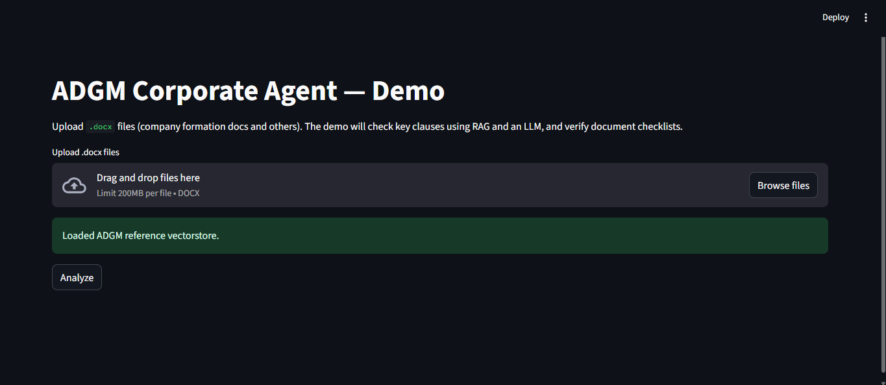
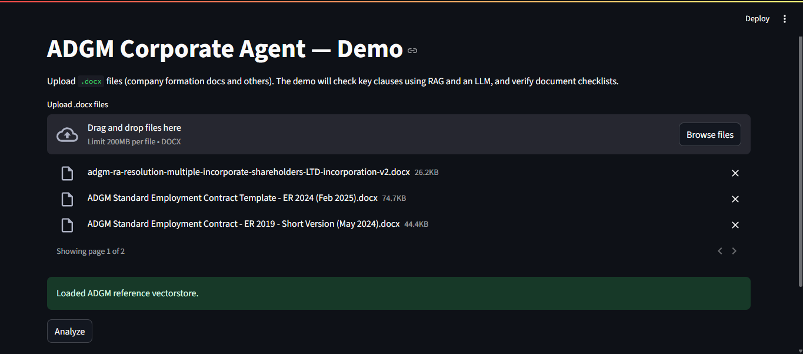
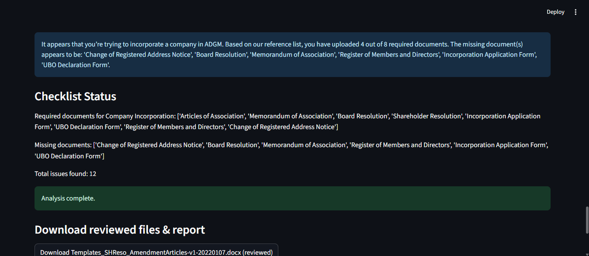

# 🏢 Corporate Agent – ADGM-Compliant Document Intelligence

## 📄 Project Overview

The **Corporate Agent** is an AI-powered legal assistant designed to review, validate, and prepare documentation for **business incorporation and compliance** within the **Abu Dhabi Global Market (ADGM)** jurisdiction.

It leverages **RAG (Retrieval-Augmented Generation)** with the provided ADGM reference documents to ensure **legally accurate, real-world recommendations**.

---

## 🎯 Features

* 📂 Accepts `.docx` legal documents.
* 📁 Automatically detects the legal process type (e.g., Company Incorporation).
* ✅ Verifies completeness of submissions based on ADGM checklists.
* 🚩 Detects legal red flags and inconsistencies.
* 💬 Inserts contextual inline comments with legal references.
* 👅 Outputs a **reviewed `.docx`** with annotations.
* 📊 Generates a structured JSON report summarizing findings.
* 📌 Identifies missing mandatory documents.

---

## 🛠️ Setup Instructions

### 1️⃣ Create a Virtual Environment

```powershell
python -m venv venv
```

### 2️⃣ Activate the Virtual Environment

**Windows (PowerShell)**

```powershell
.\venv\Scripts\activate
```

**Mac/Linux**

```bash
source venv/bin/activate
```

### 3️⃣ Install Requirements

```powershell
pip install -r requirements.txt
```

### 4️⃣ Set Environment Variables

**Windows (PowerShell)**

```powershell
$env:GEMINI_API_KEY="your_api_key_here"
```

**Mac/Linux**

```bash
export GEMINI_API_KEY="your_api_key_here"
```

### 5️⃣ Build the Vector Database

```powershell
python rag_loader.py --build --refdir adgm_docs --persist chroma_db
```

### 6️⃣ Run the Application (Streamlit)

```powershell
streamlit run app.py
```

---


## 📂 Folder Structure (Before Execution)

```
Corporate Agent/
│
├── adgm_docs/                # ADGM reference documents for RAG
├── chroma_db/                # Vector database files
├── Output/                   # Example input/output documents & JSON
├── app.py                    # Streamlit app entry point
├── checker.py                # Document checking logic
├── doc_parser.py             # Document parsing utilities
├── rag_loader.py             # Loads and builds vector DB from ADGM docs
├── utils.py                  # Helper functions
├── requirements.txt          # Python dependencies
├── README.md                 # Project documentation
├── Task.pdf                  # Project task description
└── __pycache__/              # Python cache files
```

---

## 📊 Example Output JSON

```json
{
    "process": "Company Incorporation",
    "documents_uploaded": 4,
    "required_documents": 5,
    "missing_document": "Register of Members and Directors",
    "issues_found": [
        {
            "document": "Articles of Association",
            "section": "Clause 3.1",
            "issue": "Jurisdiction clause does not specify ADGM",
            "severity": "High",
            "suggestion": "Update jurisdiction to ADGM Courts."
        }
    ]
}
```

---

## 🖼️ Output Images

The following images are generated in the `Output/` folder after running the application:

| Image | Preview |
|-------|---------|
| 1.png |  |
| 2.png |  |
| 3.png |  |
| 4.png |  |

## 📌 Notes

* Ensure your `GEMINI_API_KEY` is active before running the app.
* The `rag_loader.py` script must be run **at least once** before launching the Streamlit app to build the vector database.
* Example `.docx` files and a sample JSON report are included in the `examples/` folder.

---

## 📜 License

This project is for **educational and evaluation purposes** only.
